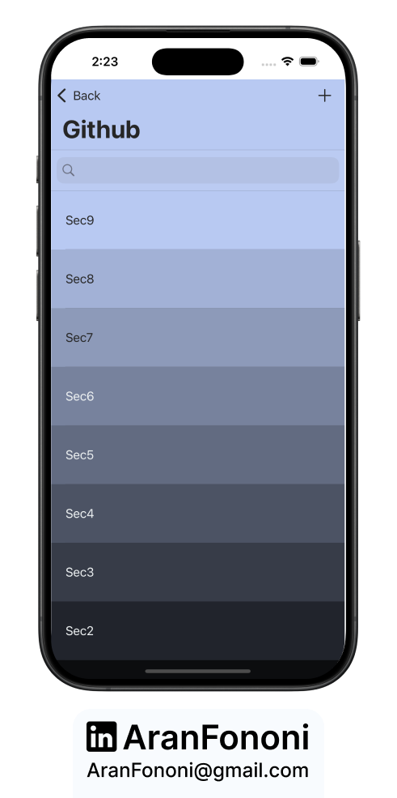
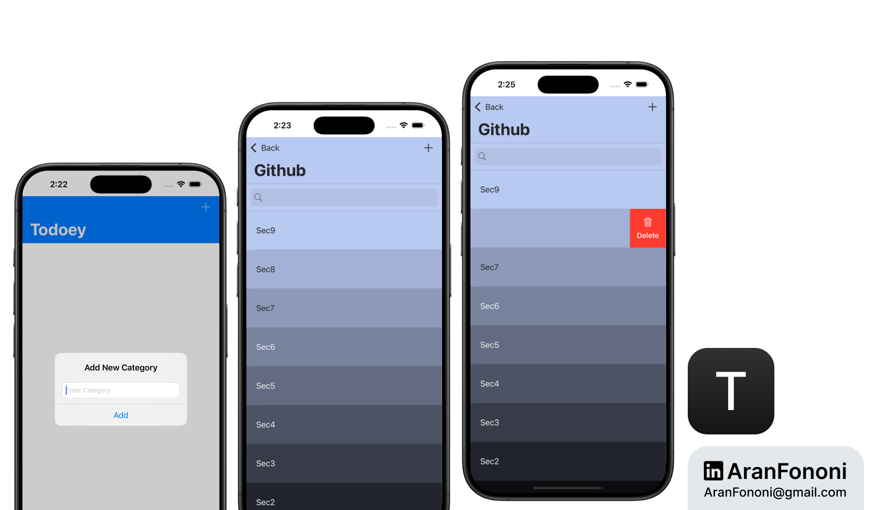

# Todoey - Realm Version

### Project for Section 19: **Todo List Application with Realm**  
This project was completed as part of Section 19 in the **Complete iOS Development Bootcamp** by Angela Yu.

## Project Overview
**Todoey** is a streamlined todo list application that allows users to manage their tasks efficiently. This version utilizes Realm for data persistence, providing a simple and fast way to handle data operations.

## What I Learned
In this project, I focused on:
- **Realm Integration**: Implemented Realm for data storage and management.
- **Efficient Data Handling**: Learned to leverage Realm’s capabilities for quick data operations.
- **TableView and Search Management**: Continued experience with UITableView and search functionalities.

## Key Skills
- Proficient in using Realm for data persistence
- Experience in managing UITableView and its data source
- Understanding of how to filter data in Realm queries

## Additional Features
- Simple interface for adding and checking tasks.
- Search functionality for easy item retrieval.

---

### Project Preview

---

### Footer

---

## Contact
For more information, feel free to reach out:  
- **Email**: [aranfononi@gmail.com](mailto:aranfononi@gmail.com)  
